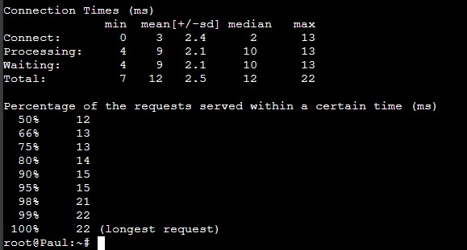

# Jarkom-Modul-3-IT23-2024
**Praktikum Jaringan Komputer Modul 3 Tahun 2024**

# Laporan Resmi
| Nama | NRP |
| ---- | ---- |
| Etha Felisya Br Purba | 5027221017 |
| Rahmad Aji Wicaksono | 5027221034 |

## Daftar Isi
1. [Laporan Resmi](#Laporan-Resmi)
2. [Daftar Isi](#Daftar-Isi)
3. [Topologi](#Topologi)
4. [Konfigurasi](#Konfigurasi)
5. [Install Dependencies](#Install-Dependencies)
6. [Soal 1](#Soal-1)
7. [Soal 2](#Soal-2)
8. [Soal 3](#Soal-3)
9. [Soal 4](#Soal-4)
10. [Soal 5](#Soal-5)
11. [Soal 6](#Soal-6)
12. [Soal 7](#Soal-7)
13. [Soal 8](#Soal-8)
14. [Soal 9](#Soal-9)
15. [Soal 10](#Soal-10)
16. [Soal 11](#Soal-11)
17. [Soal 12](#Soal-12)
18. [Soal 13](#Soal-13)
18. [Soal 14](#Soal-14)
18. [Soal 15](#Soal-15)
18. [Soal 16](#Soal-16)
18. [Soal 17](#Soal-17)
18. [Soal 18](#Soal-18)
18. [Soal 19](#Soal-19)
18. [Soal 20](#Soal-20)

## Topologi
 

## Konfigurasi
* Arakis (DHCP Relay)
```
# DHCP config for eth0
auto eth0
iface eth0 inet dhcp

auto eth1
iface eth1 inet static
	address 10.75.1.0
	netmask 255.255.255.0

auto eth2
iface eth2 inet static
	address 10.75.2.0
	netmask 255.255.255.0

auto eth3
iface eth3 inet static
	address 10.75.3.0
	netmask 255.255.255.0

auto eth4
iface eth4 inet static
	address 10.75.4.0
	netmask 255.255.255.0
```
* Irulan (DNS Server)
```
auto eth0
iface eth0 inet static
	address 10.75.3.3
	netmask 255.255.255.0
	gateway 10.75.3.0
```
* Mohiam (DHCP Server)
```
auto eth0
iface eth0 inet static
	address 10.75.3.2
	netmask 255.255.255.0
	gateway 10.75.3.0
```
* Stilgar (Load Balancer)
```
auto eth0
iface eth0 inet static
	address 10.75.4.3
	netmask 255.255.255.0
	gateway 10.75.4.0
```
* Chani (Databse Server)
```
auto eth0
iface eth0 inet static
	address 10.75.4.2
	netmask 255.255.255.0
	gateway 10.75.4.0
```
* Leto (Laravel Worker)
```
auto eth0
iface eth0 inet static
	address 10.75.2.4
	netmask 255.255.255.0
	gateway 10.75.2.0
```
* Duncan (Laravel Worker)
```
auto eth0
iface eth0 inet static
	address 10.75.2.3
	netmask 255.255.255.0
	gateway 10.75.2.0

```
* Jessica (Laravel Worker)
```
auto eth0
iface eth0 inet static
	address 10.75.2.2
	netmask 255.255.255.0
	gateway 10.75.2.0
```
* Vladimir (PHP Worker)
```
auto eth0
iface eth0 inet static
	address 10.75.1.4
	netmask 255.255.255.0
	gateway 10.75.1.0
```
* Rabban (PHP Worker)
```
auto eth0
iface eth0 inet static
	address 10.75.1.3
	netmask 255.255.255.0
	gateway 10.75.1.0
```
* Feyd (PHP Worker)
```
auto eth0
iface eth0 inet static
	address 10.75.1.2
	netmask 255.255.255.0
	gateway 10.75.1.0
```
* Dmitri, Paul (Client)
```
auto eth0
iface eth0 inet dhcp
```

## Install Depedencies
* Arakis (DHCP Relay)
```
apt-get update
apt-get install isc-dhcp-relay -y
```
* Irulan (DNS Server)
```
apt-get update
apt-get install bind9 -y
```
* Mohiam (DHCP Server)
```
apt-get update
apt-get install isc-dhcp-server -y
```
* Stilgar (Load Balancer)
```
apt-get update
apt-get install apache2-utils -y
apt-get install nginx -y
apt-get install lynx -y
```
* Chani (Databse Server)
```
apt-get update
apt-get install mariadb-server -y
```
* Leto, Duncan, Jessica (Laravel Worker)
* Vladimir, Rabban, Feyd (PHP Worker)
* Dmitri, Paul (Client)
```
apt-get update
apt-get install lynx -y
apt-get install htop -y
apt-get install apache2-utils -y
apt-get install jq -y
```

## Nomor 0
> Planet Caladan sedang mengalami krisis karena kehabisan spice, klan atreides berencana untuk melakukan eksplorasi ke planet arakis dipimpin oleh duke leto mereka meregister domain name atreides.yyy.com untuk worker Laravel mengarah pada Leto Atreides.<br>
> Namun ternyata tidak hanya klan atreides yang berusaha melakukan eksplorasi, Klan harkonen sudah mendaftarkan domain name harkonen.yyy.com untuk worker PHP (0) mengarah pada Vladimir Harkonen

Lakukan [konfigurasi](#Konfigurasi), kemudian buat domain atreides.it23.com yang mengarah ke ip Leto dan domain harkonen.it23.com yang mengarah ke ip Vladimir

#### Script
**Irulan**
```
apt-get update
apt-get install bind9 -y

forward="options {
directory \"/var/cache/bind\";
forwarders {
  	   192.168.122.1;
};

allow-query{any;};
listen-on-v6 { any; };
};
"
echo "$forward" > /etc/bind/named.conf.options

echo "zone \"atreides.it23.com\" {
	type master;
	file \"/etc/bind/jarkom/atreides.it23.com\";
};

zone \"harkonen.it23.com\" {
	type master;
	file \"/etc/bind/jarkom/harkonen.it23.com\";
};
" > /etc/bind/named.conf.local

mkdir /etc/bind/jarkom

riegel="
;
;BIND data file for local loopback interface
;
\$TTL    604800
@    IN    SOA    atreides.it23.com. root.atreides.it23.com. (
        2        ; Serial
                604800        ; Refresh
                86400        ; Retry
                2419200        ; Expire
                604800 )    ; Negative Cache TTL
;                   
@    IN    NS    atreides.it23.com.
@       IN    A    10.75.2.4
"
echo "$riegel" > /etc/bind/jarkom/atreides.it23.com

granz="
;
;BIND data file for local loopback interface
;
\$TTL    604800
@    IN    SOA    harkonen.it23.com. root.harkonen.it23.com. (
        2        ; Serial
                604800        ; Refresh
                86400        ; Retry
                2419200        ; Expire
                604800 )    ; Negative Cache TTL
;                   
@    IN    NS    harkonen.it23.com.
@       IN    A    10.75.1.4
"
echo "$granz" > /etc/bind/jarkom/harkonen.it23.com

service bind9 restart
```
#### Result


## Nomor 1
> (1) Lakukan konfigurasi sesuai dengan peta yang sudah diberikan. <Br> Kemudian, karena masih banyak spice yang harus dikumpulkan, bantulah para aterides untuk bersaing dengan harkonen dengan kriteria berikut.: <Br> Semua CLIENT harus menggunakan konfigurasi dari DHCP Server. <Br>
> Client yang melalui House Harkonen mendapatkan range IP dari [prefix IP].1.14 - [prefix IP].1.28 dan [prefix IP].1.49 - [prefix IP].1.70 (2) <Br>
> Client yang melalui House Atreides mendapatkan range IP dari [prefix IP].2.15 - [prefix IP].2.25 dan [prefix IP].2 .200 - [prefix IP].2.210 (3) <Br>
> Client mendapatkan DNS dari Princess Irulan dan dapat terhubung dengan internet melalui DNS tersebut (4) <Br>
> Durasi DHCP server meminjamkan alamat IP kepada Client yang melalui House Harkonen selama 5 menit sedangkan pada client yang melalui House Atreides selama 20 menit. Dengan waktu maksimal dialokasikan untuk peminjaman alamat IP selama 87 menit (5)
*house == switch

Pertama-tama, lakukan setup DHCP Relay terlebih dahulu pada AURA.
#### Script
* **Arakis**
```
iptables -t nat -A POSTROUTING -o eth0 -j MASQUERADE -s 10.75.0.0/16
apt-get update
apt install isc-dhcp-relay -y

service isc-dhcp-relay start 

echo '# Defaults for isc-dhcp-relay initscript

# sourced by /etc/init.d/isc-dhcp-relay
# installed at /etc/default/isc-dhcp-relay by the maintainer scripts

#
# This is a POSIX shell fragment
#

# What servers should the DHCP relay forward requests to?
SERVERS="10.75.3.2" 

# On what interfaces should the DHCP relay (dhrelay) serve DHCP requests?
INTERFACES="eth1 eth2 eth3 eth4"

# Additional options that are passed to the DHCP relay daemon?
OPTIONS=""' > /etc/default/isc-dhcp-relay


echo net.ipv4.ip_forward=1 > /etc/sysctl.conf

service isc-dhcp-relay restart
```

## Nomor 2,3,4,5

#### Script
Kemudian, lakukan konfigurasi DHCP Server pada HIMMEL 
* **Mohiam**
```
apt-get update
apt-get install isc-dhcp-server -y

interfaces="INTERFACESv4=\"eth0\"
INTERFACESv6=\"\"
"
echo "$interfaces" > /etc/default/isc-dhcp-server

subnet="option domain-name \"example.org\";
option domain-name-servers ns1.example.org, ns2.example.org;

default-lease-time 600;
max-lease-time 7200;

ddns-update-style-none;

subnet 10.75.1.0 netmask 255.255.255.0 {
    range 10.75.1.14 10.75.1.28;
    range 10.75.1.49 10.75.1.70;
    option routers 10.75.1.0;
    option broadcast-address 10.75.1.255;
    option domain-name-servers 10.75.3.3;
    default-lease-time 300;
    max-lease-time 5220;
}

subnet 10.75.2.0 netmask 255.255.255.0 {
    range 10.75.2.15 10.75.2.25;
    range 10.75.2.200 10.75.2.210;
    option routers 10.75.2.0;
    option broadcast-address 10.75.2.255;
    option domain-name-servers 10.75.3.3;
    default-lease-time 1200;
    max-lease-time 5220;
}

subnet 10.75.3.0 netmask 255.255.255.0 {
}

subnet 10.75.4.0 netmask 255.255.255.0 {
}

"
echo "$subnet" > /etc/dhcp/dhcpd.conf

service isc-dhcp-server restart
```
#### Result


## Nomor 15
> atreides Channel memiliki beberapa endpoint yang harus ditesting sebanyak 100 request dengan 10 request/second. Tambahkan response dan hasil testing pada peta.
> POST /auth/register (15)
> POST /auth/login (16)
> GET /me (17)

#### Script
Buat file `register.json` pada client yang berisi
* **Client**
```
echo '
{
  "username": "kelompokit23",
  "password": "passwordit23"
}
' > register.json
```
jalankan command 
```
ab -n 100 -c 10 -p register.json -T application/json http://10.75.2.4:8001/api/auth/register
```

#### Result


## Nomor 16
#### Script
Buat file `login.json` pada client yang berisi
```
echo '
{
  "username": "kelompokit03",
  "password": "passwordit03"
}
' > login.json
```
jalankan command
```
ab -n 100 -c 10 -p login.json -T application/json http://10.75.2.4:8001/api/auth/login
```
#### Result


## Nomor 17
jalankan command berikut
```
curl -X POST -H "Content-Type: application/json" -d @login.json http://10.75.2.4:8001/api/auth/login > login_output.txt
token=$(cat login_output.txt | jq -r '.token')
```

lakukan testing
```
ab -n 100 -c 10 -H "Authorization: Bearer $token" http://10.75.2.4:8001/api/me
```
#### Result


## Nomor 18
> Untuk memastikan ketiganya bekerja sama secara adil untuk mengatur atreides Channel maka implementasikan Proxy Bind pada Stilgar untuk mengaitkan IP dari Leto, Duncan, dan Jessica. (18)

#### Script
**Stilgar**
```
echo 'upstream worker-laravel { #(round-robin(default), ip_hash, least_conn, hash $request_uri consistent)
    server 10.75.2.4:8001;
    server 10.75.2.3:8002;
    server 10.75.2.2:8003;
}

server {
    listen 80;
    server_name atreides.it23.com;

    location / {
        proxy_pass http://worker-laravel;
    }
}
' > /etc/nginx/sites-available/lb-laravel

rm /etc/nginx/sites-enabled/default
ln -s /etc/nginx/sites-available/lb-laravel /etc/nginx/sites-enabled/

service nginx restart
```
lakukan testing dengan 
```
ab -n 100 -c 10 -p login.json -T application/json http://atreides.it23.com/api/auth/login
```

#### Result


kemudian jalankan command berikut di laravel worker
```
cat /var/log/nginx/fff_access.log
```


## Nomor 19
> Untuk meningkatkan performa dari Worker, coba implementasikan PHP-FPM pada Leto, Duncan, dan Jessica. Untuk testing kinerja naikkan 
> - pm.max_children
> - pm.start_servers
> - pm.min_spare_servers
> - pm.max_spare_servers
> sebanyak tiga percobaan dan lakukan testing sebanyak 100 request dengan 10 request/second kemudian berikan hasil analisisnya pada PDF.(19)

#### Script
disini saya membuat 3 script testing
testing 1
```
echo '[www]
user = www-data
group = www-data
listen = /run/php/php8.0-fpm.sock
listen.owner = www-data
listen.group = www-data
php_admin_value[disable_functions] = exec,passthru,shell_exec,system
php_admin_flag[allow_url_fopen] = off

; Choose how the process manager will control the number of child processes.

pm = dynamic
pm.max_children = 10
pm.start_servers = 5
pm.min_spare_servers = 3
pm.max_spare_servers = 8' > /etc/php/8.0/fpm/pool.d/www.conf

service php8.0-fpm restart
```
testing 2
```
echo '[www]
user = www-data
group = www-data
listen = /run/php/php8.0-fpm.sock
listen.owner = www-data
listen.group = www-data
php_admin_value[disable_functions] = exec,passthru,shell_exec,system
php_admin_flag[allow_url_fopen] = off

; Choose how the process manager will control the number of child processes.

pm = dynamic
pm.max_children = 20
pm.start_servers = 8
pm.min_spare_servers = 5
pm.max_spare_servers = 12' > /etc/php/8.0/fpm/pool.d/www.conf

service php8.0-fpm restart
```

testing 3
```
echo '[www]
user = www-data
group = www-data
listen = /run/php/php8.0-fpm.sock
listen.owner = www-data
listen.group = www-data
php_admin_value[disable_functions] = exec,passthru,shell_exec,system
php_admin_flag[allow_url_fopen] = off

; Choose how the process manager will control the number of child processes.

pm = dynamic
pm.max_children = 40
pm.start_servers = 10
pm.min_spare_servers = 8
pm.max_spare_servers = 15' > /etc/php/8.0/fpm/pool.d/www.conf

service php8.0-fpm restart
```

Lakukan testing pada client untuk setiap script
```
ab -n 100 -c 10 -p login.json -T application/json http://atreides.it23.com/api/auth/login
```

#### Result 
testing 1




testing 2


testing 3


## Nomor 20
> Nampaknya hanya menggunakan PHP-FPM tidak cukup untuk meningkatkan performa dari worker maka implementasikan Least-Conn pada Stilgar. Untuk testing kinerja dari worker tersebut dilakukan sebanyak 100 request dengan 10 request/second. (20)

#### Script
Tambahkan konfigurasi seperti berikut pada stilgar
```
echo 'upstream laravel_worker { #(round-robin(default), ip_hash, least_conn, hash $request_uri consistent)
least_conn;
    server 10.75.2.4:8001;
    server 10.75.2.3:8002;
    server 10.75.2.2:8003;
}

server {
    listen 80;
    server_name atreides.it23.com;

    location / {
        proxy_pass http://laravel_worker;
    }
}
' > /etc/nginx/sites-available/laravel-fff

ln -s /etc/nginx/sites-available/laravel-fff /etc/nginx/sites-enabled/

service nginx restart
```

#### Result

